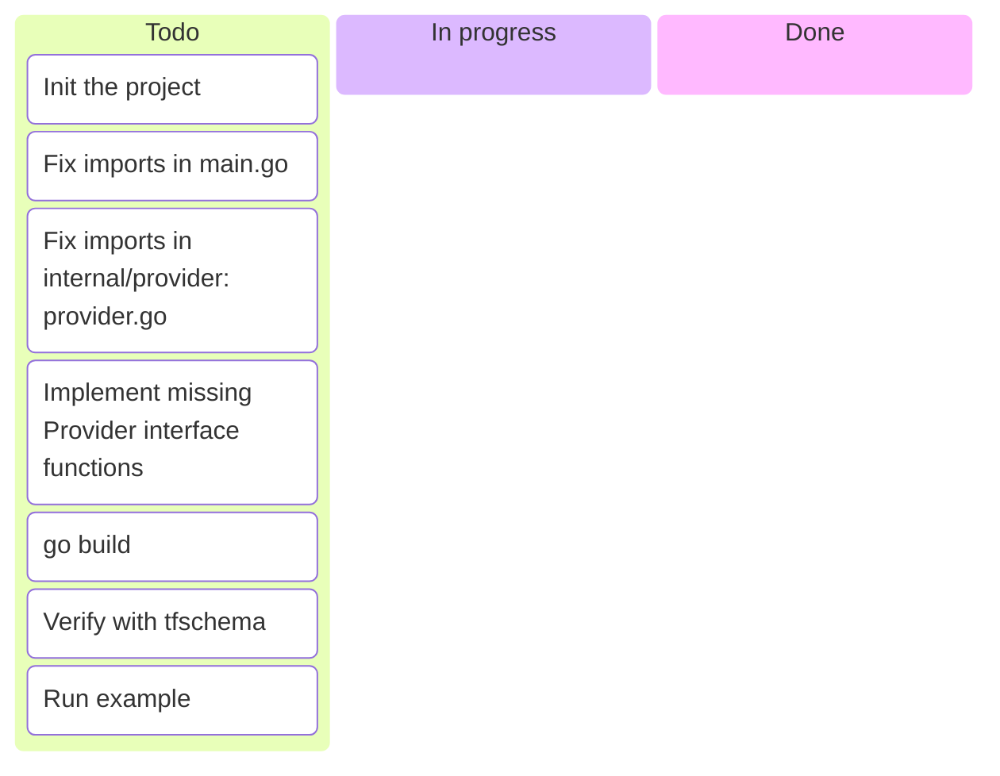
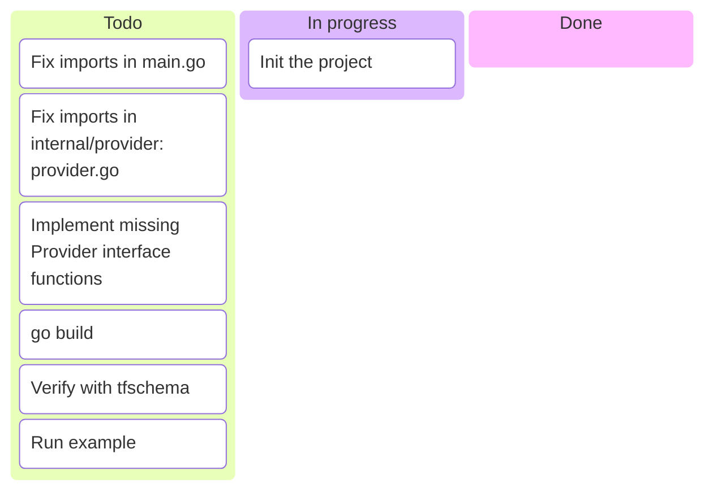
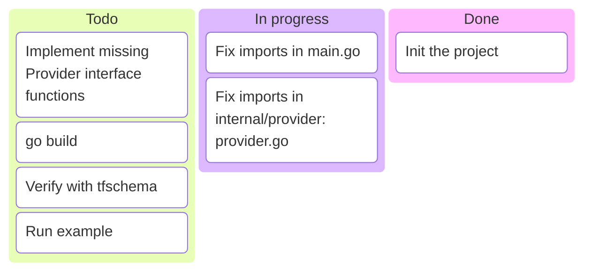
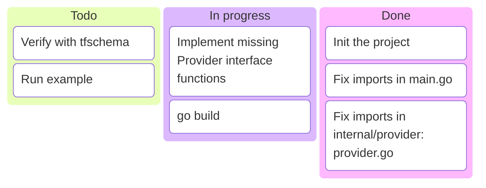
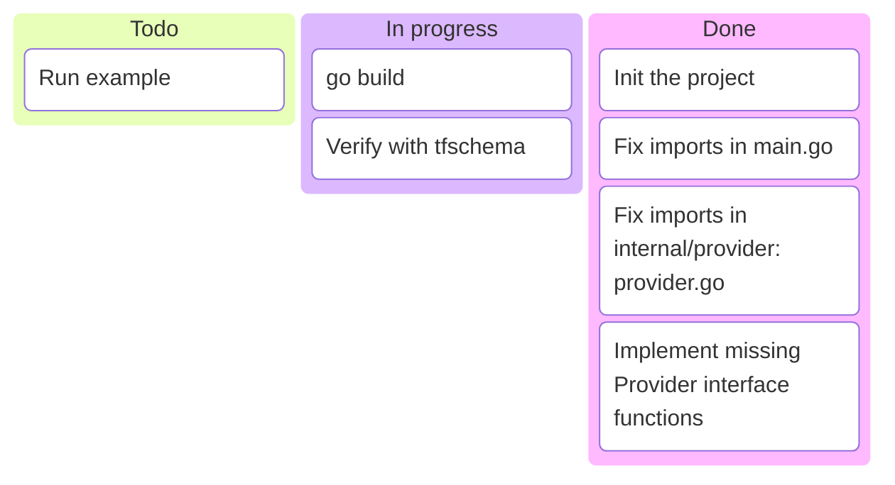
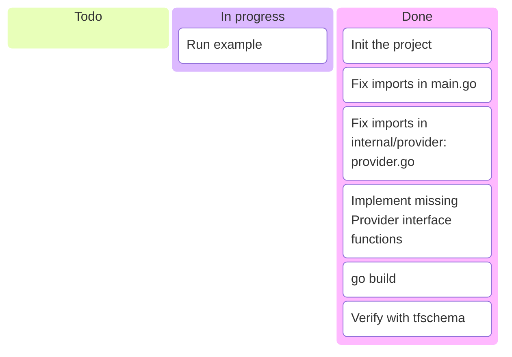
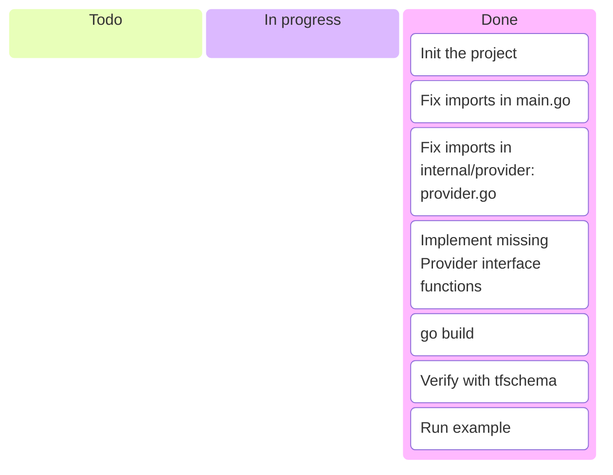

---
options:
  end_slide_shorthand: true
theme:
  override:
    default:
      margin:
        percent: 4
    code:
      alignment: center
      padding:
        vertical: 0
        horizontal: 0
---

Getting Started: A Minimal Provider
===



---

Getting Started: Exercise 0
===



---
You'll need:

* Workshop source repository cloned:
  * `git clone git@github.com:code-of-kpp/terraform-provider-workshop`

<!-- column_layout: [6, 5] -->
<!-- column: 1 -->

```ansi
█ ▄▄▄▄▄ ██▀▄██▀▄██▄  █▄▄ ▀█ ▄▄▄▄▄ █
█ █   █ █▄▀█▄▀▀█▄██▀  █▀███ █   █ █
█ █▄▄▄█ ██▄▀▀ ▄▀▀▄█▀ █▀█ ▄█ █▄▄▄█ █
█▄▄▄▄▄▄▄█ █▄▀▄█▄▀▄▀▄▀▄▀▄█ █▄▄▄▄▄▄▄█
█▄▄▄▀▄ ▄▄ ▀█▀ ▀██▀▄██▀ ▀█   ██▀▄█▀█
█ ▄ ██ ▄▀▀▀ ▄ ▀ █▀▀ ▀▀▀▄█▀█ █▀ █ ▄█
█▄▄   ▀▄▀ █  ██ ▄  █▄▄▄▄▄   ▀█ ▀█ █
█▄▀█▄ █▄██  ▀█▄█▀▄▀█▀▀ ▀▀▀▄▀▀█▀█ ▄█
██▀▄█▄ ▄█ █▄▀ ▀█▄  █▄  ▀▄▄  ███▀▄ █
█   █▀ ▄█▀▀█▄ ▀ ██▀▀█▄▀█▀▀▄█▄▄ █ ▄█
██▄▀▄█ ▄ ▀█  ██ █▀ ▀█▀ ██ ▀ ▄██▀▄ █
█▄▀▀█ ▄▄ ▀█▀▀█▄███ ▄█▀▀▀▀ ▄▀▀ ▄█ ▄█
█▄█▄█▄▄▄▄▀▀▄▀ ▀█▄ ▄▄▄  ▀▀ ▄▄▄ ██▀▀█
█ ▄▄▄▄▄ █ █ ▄ ▀ █▄▀▀█  ▄▄ █▄█ ▄█  █
█ █   █ █▄▀█ ██ █▀ ▀█  ▀█ ▄▄  ▀▀█▀█
█ █▄▄▄█ █ ▀ ▀█▄██▀ ▀▀█ ▄ ▀▀█ ▄▄▄▀▄█
█▄▄▄▄▄▄▄█▄█▄█▄██▄▄▄██▄▄█▄▄▄█▄▄▄█▄▄█
```

<!-- column: 0 -->

* Go environment — should work even with relatively old versions.

<!-- new_line -->

* `tofu` tool
  * e.g., `brew install opentofu`
  * Original `terraform` would work as well, just replace `tofu` with `terraform`

<!-- new_line -->

* Provider schema tool (optional):
  * [`tfschema`](https://github.com/minamijoyo/tfschema)
  * e.g.,
     `brew install minamijoyo/tfschema/tfschema`

<!-- reset_layout -->
* Official Hashicorp example (optional):
  * `git clone git@github.com:hashicorp/terraform-provider-scaffolding-framework`

---

Initialize the Project
===

I suggest creating a new folder for the workshop and a folder for each exercise.
Moving to the next exercise, deep-copy the folder with the previous solution.

However, you can work in a single folder.

<!-- column_layout: [6, 14] -->

<!-- column: 0 -->

File structure:

```text
00-solution/
├── go.mod
├── go.sum
├── internal/
│   └── provider/
│       └── provider.go
└── main.go
```

<!-- column: 1 -->

Bootstrap:

```bash
mkdir -p 00-solution/internal/provider
cd 00-solution

go mod init \
  "github.com/${YOUR_NAME}/terraform-provider-playground"
```

(Replace `${YOUR_NAME}` or use any module path you like.)

<!-- reset_layout -->

> [!NOTE]
> Just build a minimal Go project for now.

---

Getting Started: Exercise 0
===



---

`main.go`:

```go +line_numbers {1-30|9,20|1-30}
package main

import (
	"context"
	"log"

	"github.com/hashicorp/terraform-plugin-framework/providerserver"

	/* TODO: import **your** internal/provider module here */
)

// for goreleaser
var version string = "dev"

func main() {
	opts := providerserver.ServeOpts{
		// TODO: fix your username. Unless you plan to publish, any path will do.
		Address: "registry.opentofu.org/example/playground",
	}
	err := providerserver.Serve(context.Background(), provider.New(version), opts)
	if err != nil {
		log.Fatal(err.Error())
	}
}
```

---

`internal/provider/provider.go`:

```go +line_numbers {1-30|10-11|12-16|18,22|1-30}
package provider

import (
	"context"

	"github.com/hashicorp/terraform-plugin-framework/provider/schema"
	// .../terraform-plugin-framework/{provider,datasource,resource}
)

var _ provider.Provider = &PlaygroundProvider{}  // Hints what's still missing
type PlaygroundProvider struct{ version string } // Main provider struct
func New(version string) func() provider.Provider { // optional factory shortcut
	return func() provider.Provider {
		return &PlaygroundProvider{version: version}
	}
}

func (p *PlaygroundProvider) Metadata(
	ctx context.Context, req provider.MetadataRequest,
	resp *provider.MetadataResponse,
) {
	resp.TypeName = "playground" // Prefix in terraform data & resource blocks
	resp.Version = p.version
}
```

---

Getting Started: Exercise 0
===



---

Task: Implement the Interface (Add Stubs)
===

```go +line_numbers
type Provider interface {
    // Metadata should return the metadata for the provider, such as
    // a type name and version data. We should have it done.
    Metadata(context.Context, MetadataRequest, *MetadataResponse)

    // Schema should return the schema for this provider.
    // Just set resp.Schema = schema.Schema{} for now.
    Schema(context.Context, SchemaRequest, /* resp */ *SchemaResponse)

    // Configure is called at the beginning of the provider lifecycle, when
    // Terraform sends to the provider the values the user specified in the
    // provider configuration block. These are supplied in the req argument.
    // Values from provider configuration are often used to initialise an
    // API client, which should be stored on the struct implementing the
    // Provider interface. Keep it a no-op for now.
    Configure(context.Context, /* req */ ConfigureRequest, *ConfigureResponse)

    // For now, return empty slices from both.
    DataSources(context.Context) []func() datasource.DataSource
    Resources(context.Context) []func() resource.Resource
}
```

---

Getting Started: Exercise 0
===



---

Check the Binary
===

```bash +exec +line_numbers
cd 00-solution

go get && go mod tidy

go build -v

./terraform-provider-playground

tfschema provider show playground
```

---

Getting Started: Exercise 0
===



---

Crafting an Example
===

```bash
mkdir -p examples/provider
```

`examples/provider/provider.tf`:

```terraform +line_numbers
terraform {
  required_providers {
    // Provider installation:
    playground = {
      // TODO: fix username, should be the same as in main.go
      source = "registry.opentofu.org/example/playground"
    }
  }
}

// Provider configuration:
provider "playground" {}
```

> [!NOTE]
> Examples are part of documentation, including auto-generated documentation.

---

Development Overrides
===

We haven't yet published our package, so we need to let OpenTofu know
where it can find the provider binary. Create/edit `examples/provider/terraform.rc`:

```terraform +line_numbers
provider_installation {
  dev_overrides {
    // same as `source` in `provider.tf` and as `Address` in `main.go`
    "registry.opentofu.org/example/playground" = "../../" // relative or absolute
  }
}
```

There are other ways to point OpenTofu to your binary, e.g.,
by placing it into cache. We'll stick with the overrides because we'll have
multiple versions of the same binary flying around.

[`TF_CLI_CONFIG_FILE`](https://opentofu.org/docs/cli/config/environment-variables/#tf_cli_config_file)

[`tofu.rc` and `terraform.rc`](https://opentofu.org/docs/cli/config/config-file/#development-overrides-for-provider-developers)

---

Running an Example
===

```bash +line_numbers +exec
cd 00-solution/examples/provider

export TF_CLI_CONFIG_FILE=terraform.rc
# tofu init # we can skip init because of development overrides
tofu apply  # should be a no-op
```

---

Verifying (Empty) State
===

```bash +exec
cd 00-solution/examples/provider

# this should be empty
tofu state list

jq --color-output . terraform.tfstate
```

---

Getting Started: Exercise 0
===


