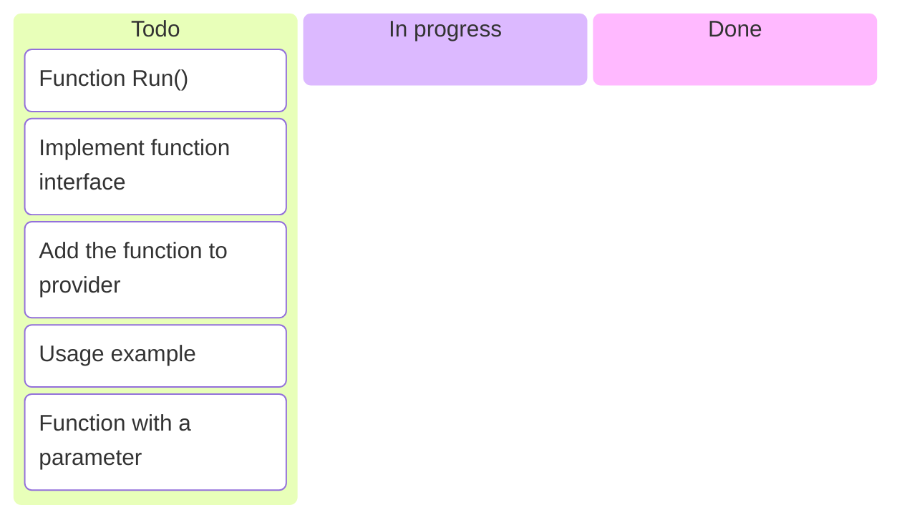
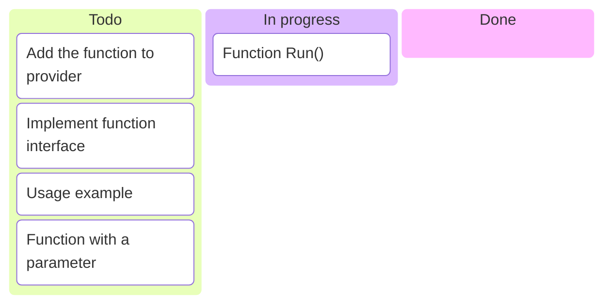
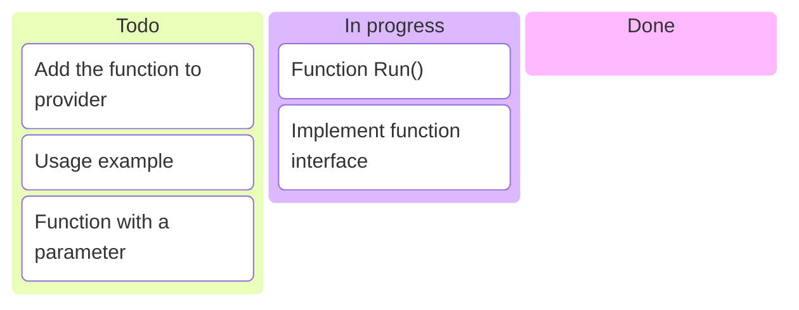
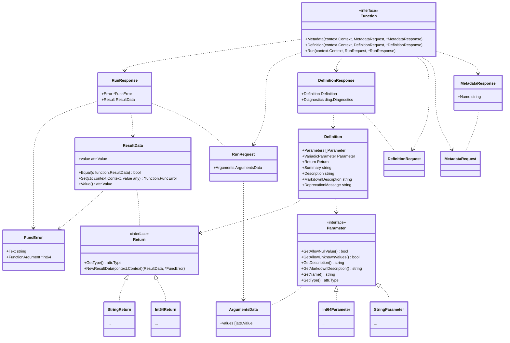
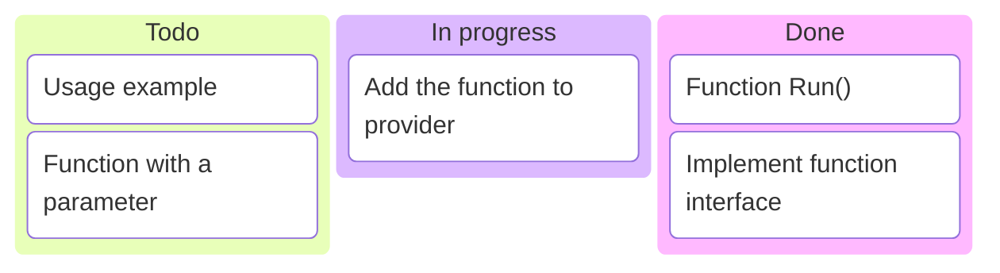
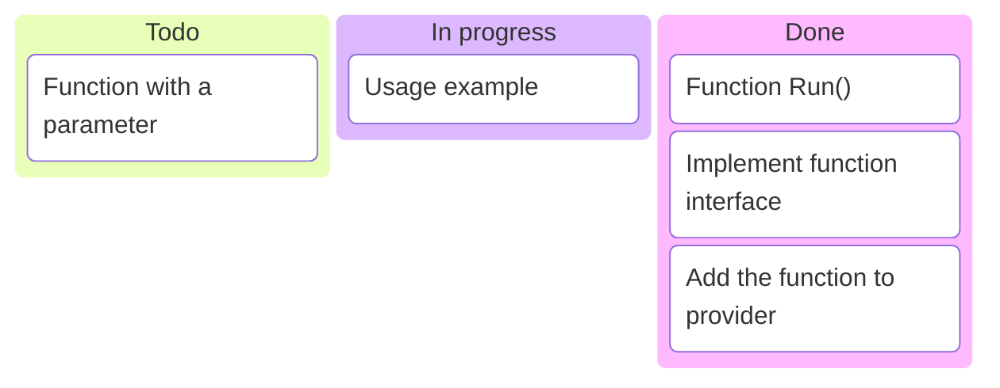
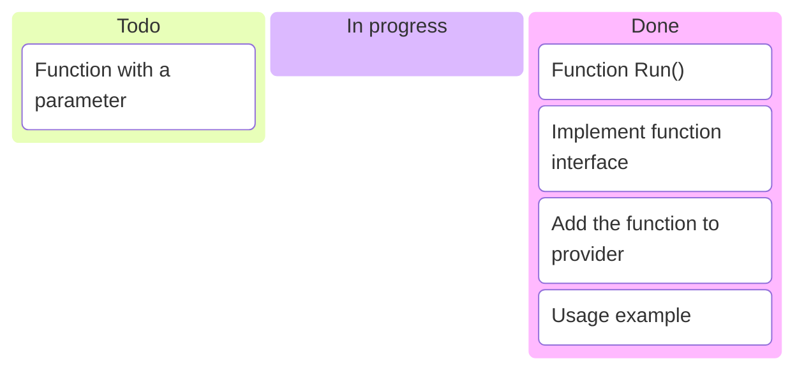
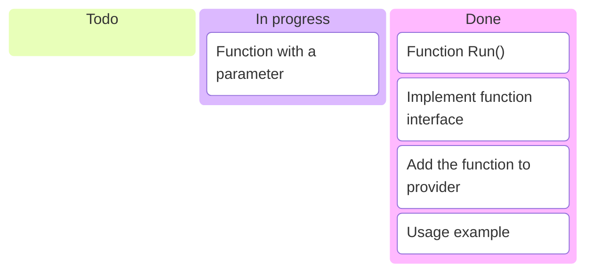
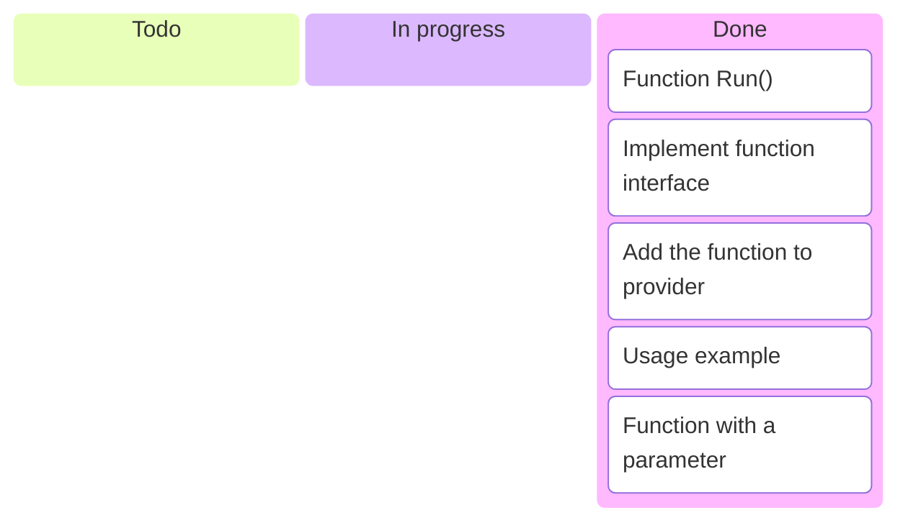

---
options:
  end_slide_shorthand: true
theme:
  override:
    default:
      margin:
        percent: 4
    code:
      alignment: center
      padding:
        vertical: 1
        horizontal: 1
---

Exercise 1: Introducing Provider Functions
===



---

Exercise 1: Introducing Provider Functions
===

Provider functions are relatively new concept in Terraform world.

Functions are stateless, they are not a part of resource graph, they don't
typically call APIs, but can provide validation logic,
simplify HCL expressions, and more.

In OpenTofu, Functions can be configured together with the provider, but
to implement this one has to use low-level libraries.

Tasks
===

1. A provider function that outputs the **Ultimate answer to the Life,
    the Universe and Everything**.
2. A provider function that checks the validity of a *local path* that
    we'd like to use for our playground later.

---

Exercise 1a: Minimalistic Function
===



---

`internal/provider/meaning_of_life_function.go`:

```go +line_numbers {1-30|9,11|14,24,25|23,27,13,19}
package provider

import (
	"context"

	"github.com/hashicorp/terraform-plugin-framework/function"
)

var _ function.Function = MeaningOfLifeFunction{}

type MeaningOfLifeFunction struct{}

func (f MeaningOfLifeFunction) Run(
	ctx context.Context, req function.RunRequest, resp *function.RunResponse,
) {
	resp.Error = function.ConcatFuncErrors(
		// func (d *function.ResultData) Set(ctx context.Context, value any)
		// *function.FuncError
		resp.Result.Set(ctx, 42),
	)
}

func (f MeaningOfLifeFunction) Metadata(
	ctx context.Context,
	req function.MetadataRequest, resp *function.MetadataResponse,
) {
	resp.Name = "meaning_of_life"
}
```

---

Exercise 1a: Minimalistic Function
===



---

1a. Task: Implement the Interface
===

```go +line_numbers {1-8|2,9-20}
type Function interface {
	Definition(context.Context, DefinitionRequest, *DefinitionResponse)
	// Same as with the provider metadata: resp.Name = "meaning_of_life"
	Metadata(context.Context, MetadataRequest, *MetadataResponse)
	// Argument data values should be read from the [RunRequest] and the
	// result value set in the [RunResponse]. For now: resp.Result.Set(ctx, 42)
	Run(context.Context, RunRequest, *RunResponse)
}
func (f MeaningOfLifeFunction) Definition( // Similar to Schema in Provider
	ctx context.Context, req function.DefinitionRequest,
	resp *function.DefinitionResponse,
) {
	resp.Definition = function.Definition{
		Parameters: []function.Parameter{},
		Return:     function.Int64Return{},
		Summary:    "Meaning of Life function",
		MarkdownDescription: "Provides the Ultimate answer " +
			"to Life, the Universe and Everything",
	}
}
```

---



---

Exercise 1a: Minimalistic Function
===



---

1a. "Install" the `Function`
===

Change `internal/provider/provider.go`:

```diff
+var _ provider.ProviderWithFunctions = &PlaygroundProvider{}

 // Main provider struct
 type PlaygroundProvider struct {
        version string
 }

+func (p *PlaygroundProvider) Functions(
+	ctx context.Context,
+) []func() function.Function {
+       return []func() function.Function{
+               NewMeaningOfLifeFunction,
+       }
+}
```

---

Exercise 1a: Minimalistic Function
===



---

`examples/functions/meaning_of_life.tf`:

```terraform +line_numbers
terraform {
  required_providers {
    playground = {
      source = "registry.opentofu.org/example/playground"
    }
  }
}

provider "playground" {}

output "what-we-are-here-for" {
  value = provider::playground::meaning_of_life()
}
```

> [!IMPORTANT]
> Reminder: `terraform.rc` pointing to the current binary.

---

```bash +line_numbers +exec
cd 01-solution && go build -v
cd examples/functions
TF_CLI_CONFIG_FILE=terraform.rc \
    tofu apply --auto-approve
```

---

1a. Check the State
===

```bash +line_numbers +exec
cd 01-solution/examples/functions

tofu state list # this will still be empty
jq --color-output . terraform.tfstate # but here we'll see the output
```

---

Exercise 1a: Minimalistic Function
===



---

Exercise 1b: Function with a Parameter
===



---

1b. Function with Parameter: Motivation
===

**Task**: A provider function that checks if a *local path* we'd like to use
for our playground later:

- Is a valid path (through an error otherwise)
- Exists
- Is not used in production (Does not contain substring `production`.)

Let's try to do this:

```terraform +line_numbers {1-10|6|1-10}
variable "playground_path" {
  type        = string
  description = "Local path for our playground!"
  default     = "."
  validation {
    condition     = provider::playground::valid_path(var.playground_path)
    error_message = "The playground path is not valid."
  }
}
```

---

1b. Function with Parameter: the Interface
===

1. Start with copying the `meaning_of_life` `Function`.
2. Don't forget to "install" your new Function.
3. Apply the examples.

```go +line_numbers
type Function interface {
	// Same as before: resp.Name = "valid_path"
	Metadata(context.Context, MetadataRequest, *MetadataResponse)

	// We'll dive into it next
	Definition(context.Context, DefinitionRequest, *DefinitionResponse)

	// Argument data values should be read from the [RunRequest] and the
	// result value set in the [RunResponse]. We'll dive into it next
	Run(context.Context, RunRequest, *RunResponse)
}
```

---

1b. Function with Parameter: `Definition`
===

In `internal/provider/valid_path_function.go`:

```go +line_numbers {1-30|6-11|7,12|1-30}
func (f ValidPathFunction) Definition(
	ctx context.Context, req function.DefinitionRequest,
	resp *function.DefinitionResponse,
) {
	resp.Definition = function.Definition{
		Parameters: []function.Parameter{
			function.StringParameter{
				Name:                "path",
				Description:         "Path to check",
			},
		},
		Return:              function.BoolReturn{},
		Summary:             "Check if path is valid for the playground",
		Description:         "Returns True if path is valid for the playground",
	}
}
```

---

`internal/provider/valid_path_function.go`:

```go +line_numbers {1-30}
func (f ValidPathFunction) Run(
	ctx context.Context, req function.RunRequest, resp *function.RunResponse,
) {
	// This is tfsdk's type! It can handle Terraform's special values
	// Call path.ValueString() to get the string.
	var path types.String

	resp.Error = function.ConcatFuncErrors(req.Arguments.Get(ctx, &path))
	if resp.Error != nil { // Error if we messed up with the type
		return
	}

	if _, err := os.Stat(path.ValueString()); err != nil {
		if os.IsNotExist(err) {
			resp.Error = function.ConcatFuncErrors(resp.Result.Set(ctx, false))
			return
		}
		resp.Error = function.NewFuncError("Error: " + err.Error())
		return
	}
	// TODO: check for substring "production": set true or false
}
```

---

Exercise 1b: Function with Parameter
===


---

```bash +line_numbers +exec
cd 01-solution && go build -v
cd examples/functions
TF_CLI_CONFIG_FILE=terraform.rc \
    tofu apply --auto-approve
```

---

1c. Additional tasks
===

<!-- font_size: 2 -->

1. Test what will happen if you will provide a wrong type as a `Return` or as `Parameters`.
2. Explore the difference in errors: error in `os.Stat` call versus
   path does not exist versus substring `production`.

---

Exercise 1: Provider Functions
===


