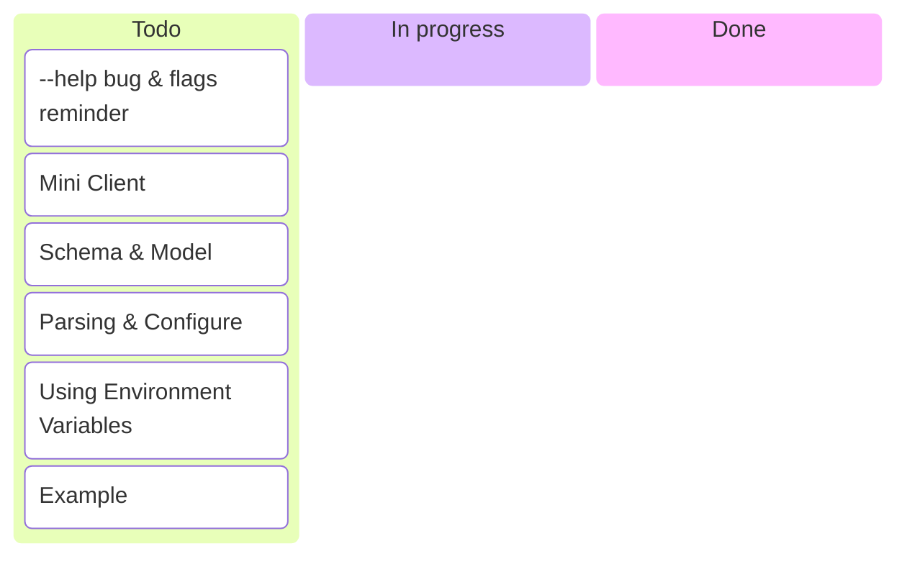
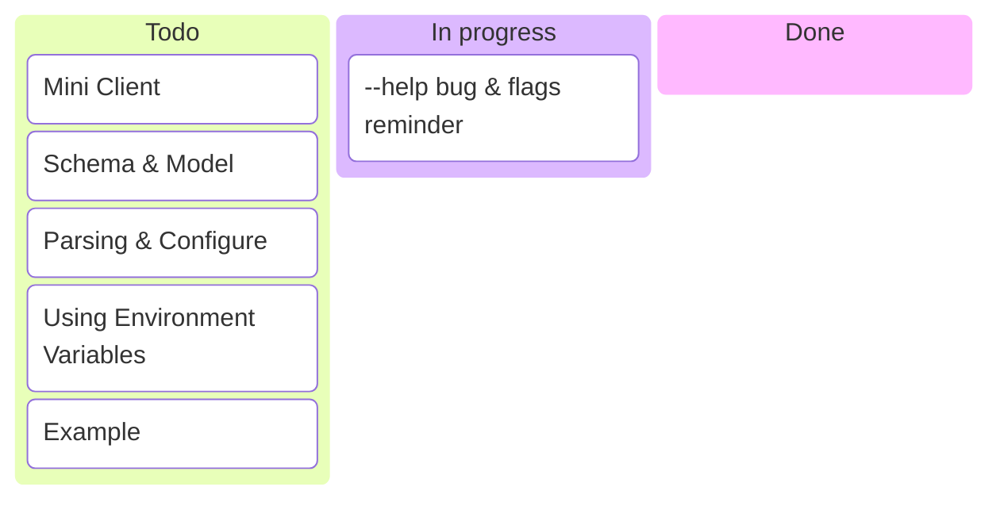
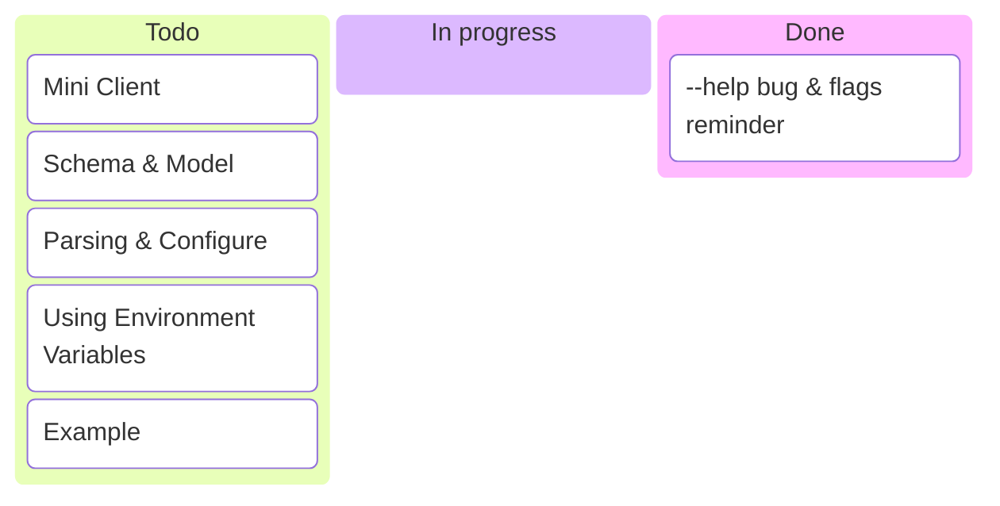
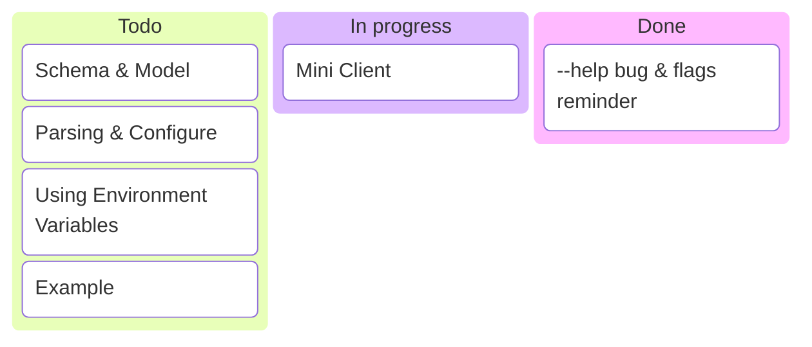
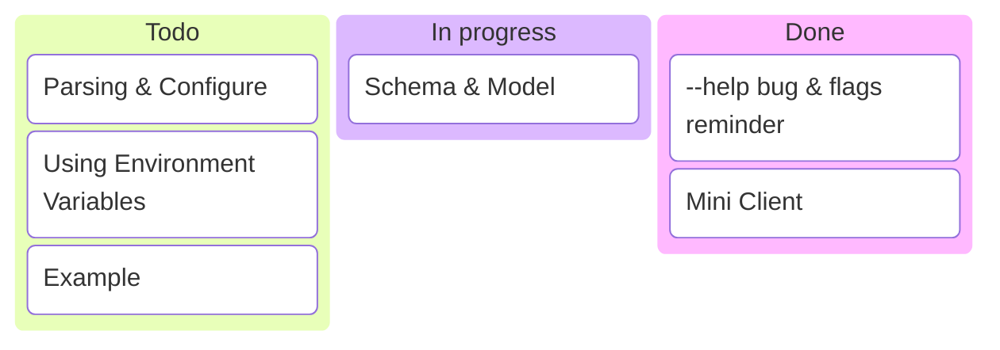
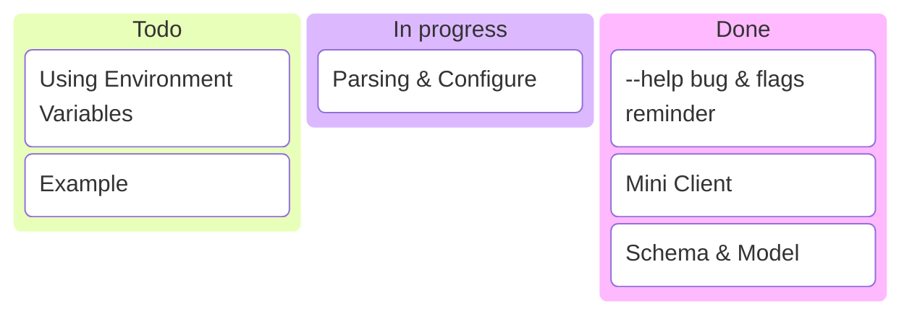
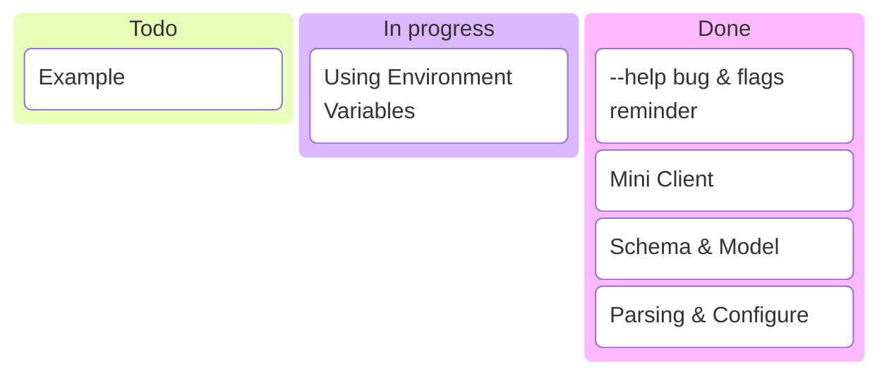
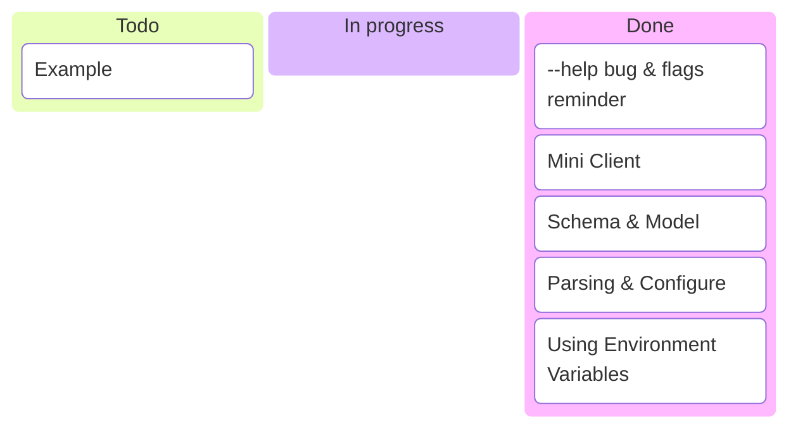
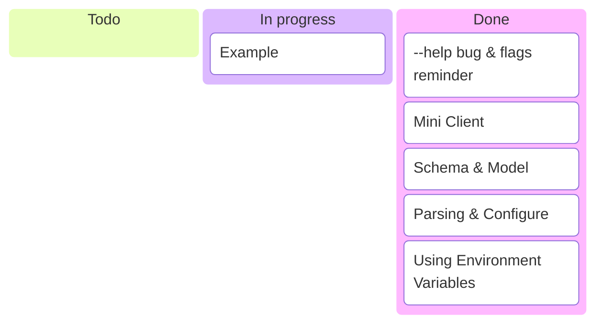
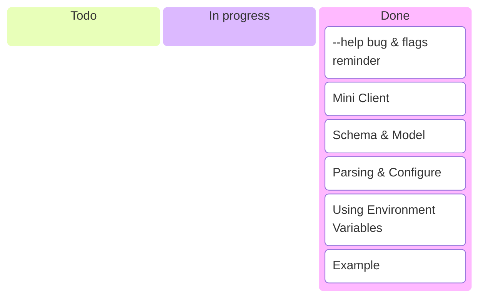

---
options:
  end_slide_shorthand: true
theme:
  override:
    default:
      margin:
        percent: 4
    code:
      alignment: center
      padding:
        vertical: 1
        horizontal: 1
---

Exercise 2: Configuring the Provider
===



---

Exercise 2: Configuring the Provider
===



---

A Little Problem to Fix First
===

```bash +line_numbers +exec
cd 01-solution

go build

./terraform-provider-playground --help
```

---

Standard `flags` Module Reminder
===

`main.go`:

```diff {1-30|7}
@@ -13,8 +14,17 @@
 var version string = "dev"

 func main() {
+	var debug bool
+
+	flag.BoolVar(
+		&debug, "debug", false,
+		"Set to true to run the provider with support for debuggers",
+	)
+	flag.Parse()
+
 	opts := providerserver.ServeOpts{
 		Address: "registry.opentofu.org/example/playground",
+		Debug:   debug,
}
```

---

```bash +line_numbers +exec
cd 02-solution
go build
./terraform-provider-playground --help
```

<!-- pause -->

Note, it has nothing to do with the provider's Schema.

---

Exercise 2: Configuring the Provider
===



---

Exercise 2: Configuring the Provider
===

**Task**: Our playground should be bound by a single folder. Everything we will
be doing should stay in that folder.

Let's add an argument to our `Provider`, so we can specify that folder.

We'll abstract it out into a `Client` `struct`, that would only hold that value
for us.

---

Exercise 2: Configuring the Provider
===



---

Exercise 2: Mini Client
===

`internal/client/client.go`:

```go +line_numbers
package client

type Client struct{ Folder string }

func New(folder string) *Client {
	return &Client{Folder: folder}
}
```

In real world, this can be any client or wrapper to any service.

---

Exercise 2: Configuring the Provider
===



---

Exercise 2: Schema & Model
===

Modify provider's `Schema` in `internal/provider/provider.go`:

```go +line_numbers {1-30|2,11|1-30}
type PlaygroundProviderModel struct { // Same as with Parsing JSON
	Folder types.String `tfsdk:"folder"`
}

func (p *PlaygroundProvider) Schema(
	ctx context.Context, req provider.SchemaRequest,
	resp *provider.SchemaResponse,
) {
	resp.Schema = schema.Schema{
		Attributes: map[string]schema.Attribute{
			"folder": schema.StringAttribute{
				MarkdownDescription: "Playground working folder",
				Required:            true,
			},
		},
	}
}
```

---

Exercise 2: Configuring the Provider
===



---

Exercise 2: Parsing & Configure
===

```go +line_numbers {1-30|5|5,9|7-13|15-16|17-18|1-30}
func (p *PlaygroundProvider) Configure(
	ctx context.Context, req provider.ConfigureRequest,
	resp *provider.ConfigureResponse,
) {
	var data PlaygroundProviderModel
	var folder string
	resp.Diagnostics.Append(
		// try to parse all fields
		req.Config.Get(ctx, &data)...,  // there might be more than 1 error
	)
	if resp.Diagnostics.HasError() { // like if err { return } but many errors
		return
	}

	folder = data.Folder.ValueString()
	play_client := client.New(folder)
	resp.DataSourceData = play_client
	resp.ResourceData = play_client
}
```

---

Exercise 2: Parsing & Configure
===

This should work, but, a bit inconvenient. If we'd run now our configuration
(**try!**), OpenTofu would face us with a prompt:

```text
provider.playground.folder
  Playground working folder

  Enter a value:
```

This is because we've specified `folder` as a `Required` attribute.
It's easy to fix, by either:

- Making it `Optional` and setting a default value in `Configure()`.
- Creating a `variable` in Terraform configuration and pointing our provider
  config to it.

However, a standard practice is to parse specific environment variables and
populate missing configuration values. (Think `AWS_CLIENT_KEY`)

---

Exercise 2: Configuring the Provider
===



---

Exercise 2: Using Environment Variables
===

We will change the attribute to be `Optional: true`.
This means that if a user didn't provide the value,
`IsNull()` will return `true`. Add to `Configure()`:

```go {1-30|1|3|1-30}
	if data.Folder.IsNull() {
		// "github.com/hashicorp/terraform-plugin-log/tflog"
		tflog.Info(ctx, "Value not provided, trying environment variable")
		folder = os.Getenv("PLAYGROUND_FOLDER")
		if folder == "" {
			resp.Diagnostics.AddError(
				"Folder not provided",
				"Provide Folder value via environment variable PLAYGROUND_FOLDER",
			)
			return
		}
	} else {
		folder = data.Folder.ValueString()
	}

	play_client := client.New(folder)
	resp.DataSourceData = play_client
	resp.ResourceData = play_client
```

---

Environment Variables: Try it out
===

Without providing the value, we should see something like this:

```text
╷
│ Error: Folder not provided
│
│   with provider["registry.opentofu.org/example/playground"],
│   on provider.tf line 9, in provider "playground":
│    9: provider "playground" {
│
│ Provide Folder value via environment variable PLAYGROUND_FOLDER
╵
```

A large part of OpenTofu provider development is to care about the
practitioners — errors will always happen, and it's better if the errors are
easy to understand.

A good practice is to give OpenTofu exact configuration path of the error,
so the practitioner will see the line they need to fix.

---

Exercise 2: Environment Variables & Errors
===

```diff
--- a/internal/provider.go
+++ b/internal/provider.go
@@ -6,6 +6,7 @@

 	"github.com/hashicorp/terraform-plugin-framework/datasource"
 	"github.com/hashicorp/terraform-plugin-framework/function"
+	"github.com/hashicorp/terraform-plugin-framework/path"
 	"github.com/hashicorp/terraform-plugin-framework/provider"
 	"github.com/hashicorp/terraform-plugin-framework/provider/schema"
 	"github.com/hashicorp/terraform-plugin-framework/resource"
@@ -77,7 +78,8 @@
 		tflog.Info(ctx, "Value not provided, trying environment variable")
 		folder = os.Getenv("PLAYGROUND_FOLDER")
 		if folder == "" {
-			resp.Diagnostics.AddError(
+			resp.Diagnostics.AddAttributeError(
+				path.Root("folder"),
 				"Folder not provided",
 				"Provide Folder value via environment variable "+
 					"PLAYGROUND_FOLDER or configuration.",
```

---

Exercise 2: Environment Variables & Errors
===

```terraform +line_numbers
terraform {
  required_providers {
    playground = {
      source = "registry.opentofu.org/example/playground"
    }
  }
}

provider "playground" {
  folder = null // the same as not specifying it at all, but explicit
}
```

To see the log messages:

```bash
export TF_LOG=INFO
export TF_CLI_CONFIG_FILE=terraform.rc
tofu apply
```

---

```bash +line_numbers +exec
cd 02-solution && go build -v && cd examples/provider
TF_CLI_CONFIG_FILE=terraform.rc tofu apply
```

---

Exercise 2: Configuring the Provider
===



---

Exercise 2: Configuring the Provider
===



---

Exercise 2: Put It All Together
===

It would be nice to use our function to validate the path:

```terraform +line_numbers
provider "playground" {
  folder = var.playground_path
}

variable "playground_path" {
  type        = string
  description = "Local path for our playground!"
  default     = "."
  validation {
    condition     = provider::playground::valid_path(var.playground_path)
    error_message = "The playground path is not valid."
  }
}
```

---

```bash +line_numbers +exec
cd 02-solution/examples/provider-error
TF_CLI_CONFIG_FILE=terraform.rc tofu apply -auto-approve
```

---

<!-- jump_to_middle -->

Ouch
===

---

Ways out
===

Generally, we have to use regular validators instead (provided by the SDK).
But for now we can actually install our provider twice.

```terraform +line_numbers {1-30|4|8-17|1-30}
provider "playground" { folder = "." }

provider "playground" {
  alias  = "playagain" // Different "name" for the seconds instance
  folder = var.playagain_path
}

variable "playagain_path" {
  type        = string
  description = "Local path for our playground!"
  default     = "."
  validation {
    condition     = provider::playground::valid_path(var.playagain_path)
    error_message = "The playground path is not valid."
  }
}
```

---

Exercise 2: Configuring the Provider
===



---

Additional tasks
===

<!-- font_size: 2 -->

See what will happen if `tfsdk:` label and keys in the `Attributes` map do not
match.

- Add a key that is not in the Model structure
- Add a label that is not in the `Attributes` map
