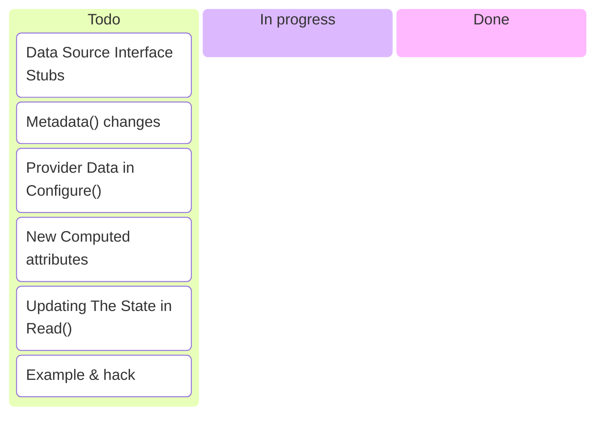
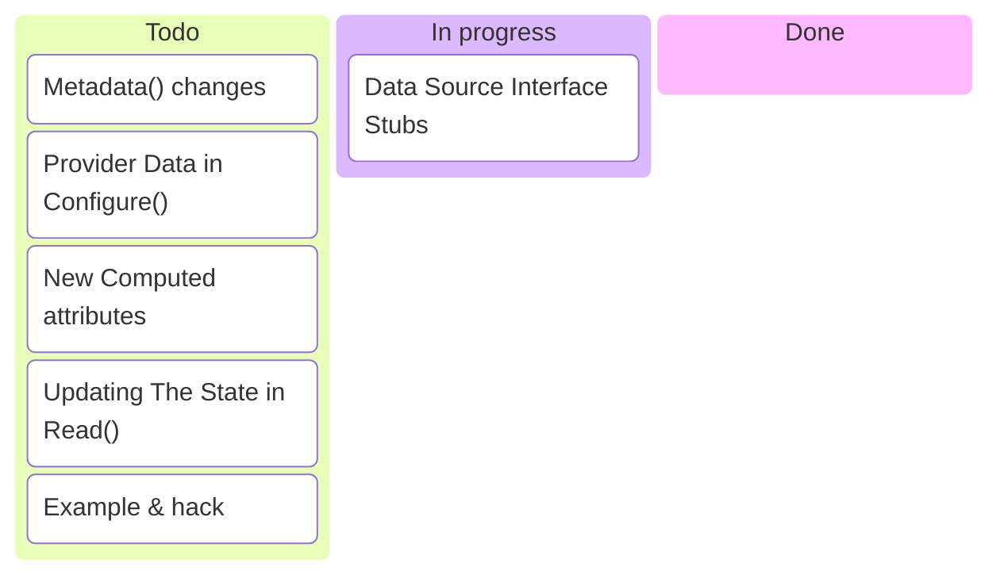
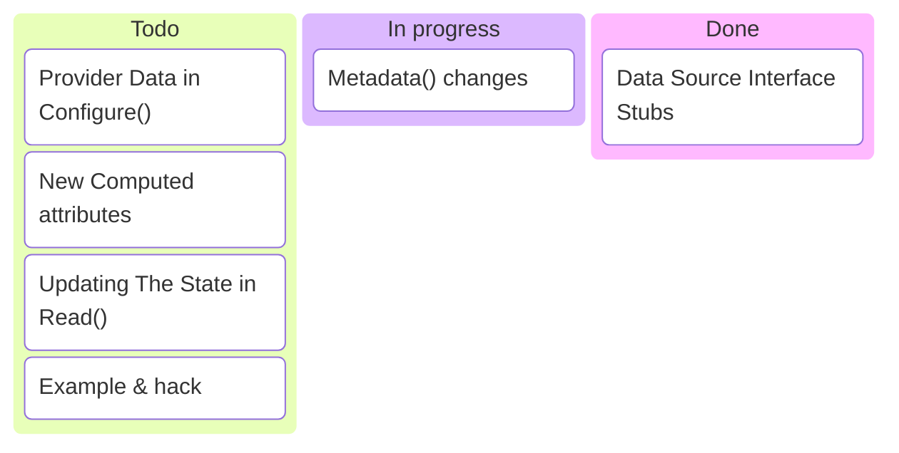
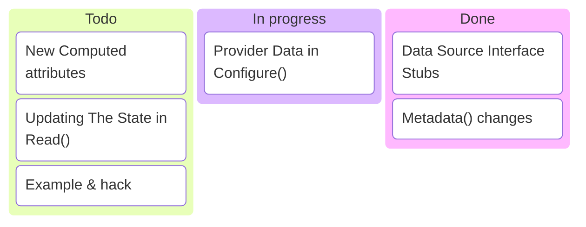
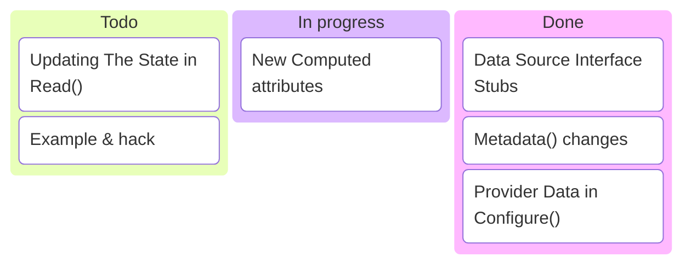
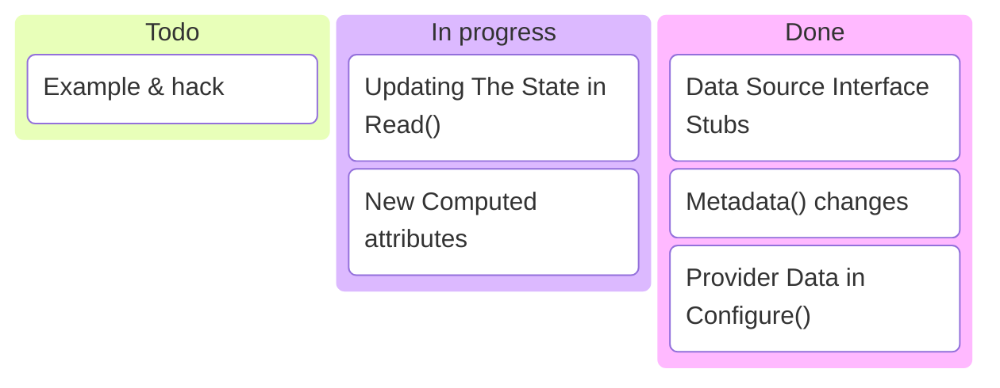
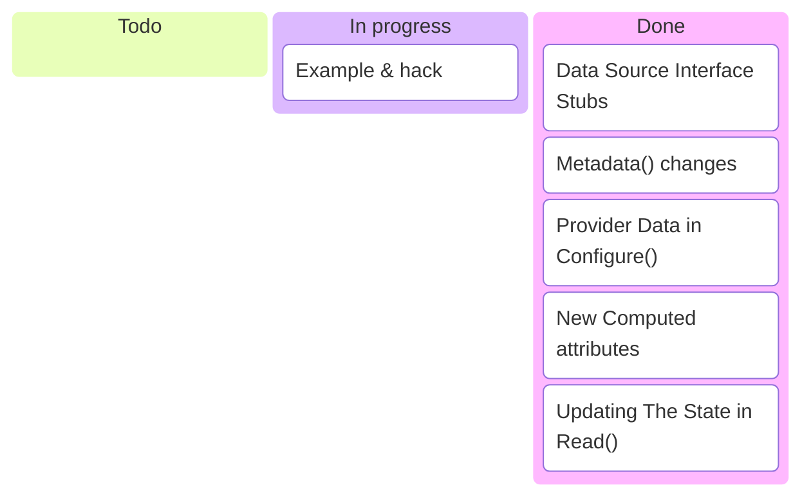
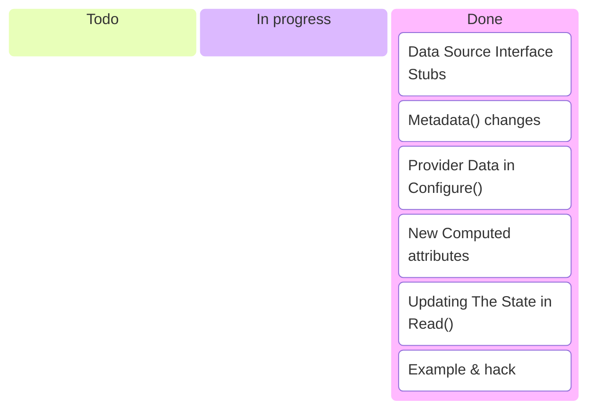

---
options:
  end_slide_shorthand: true
theme:
  override:
    default:
      margin:
        percent: 4
    code:
      alignment: center
      padding:
        vertical: 1
        horizontal: 1
---

Exercise 3: Our First Data Source
===



---

Exercise 3: Our First Data Source
===

**Task**: Implement a Data Source for Shopping List. It has two attributes:

* `file_name` — file inside our playground directory
* `number_of_items` (computed) — every line in the Shoppling List is a shopping
  item — just count them!

<!-- column_layout: [1,1] -->
<!-- column: 0 -->

Config should look like this:

```terraform
data "playground_shopping_list" "a" {
  file_name = "shop.list"
}
```

<!-- column: 1 -->

And the state should be like this:

```terraform
data "playground_shopping_list" "a" {
    file_name       = "shop.list"
    number_of_items = 3
}
```

---

Exercise 3: Our First Data Source
===



---

Exercise 3: Implement Interfaces (Stubs)
===

```go +line_numbers
type DataSource interface {
    // Return the **full name** of the data source, e.g., myprovider_datasrc
    Metadata(context.Context, MetadataRequest, *MetadataResponse)

    Schema(context.Context, SchemaRequest, *SchemaResponse)

    // Read is called when the provider must read data source values in
    // order to update state. Config values should be read from the
    // ReadRequest and new state values set on the ReadResponse.
    Read(context.Context, ReadRequest, *ReadResponse)
}

type DataSourceWithConfigure interface {
	DataSource

	// Note: this is called on every ReadDataSource RPC call
	// but you have access to previously configured provider data
	Configure(context.Context, ConfigureRequest, *ConfigureResponse)
}
```

---

`internal/provider/shoppling_list_data_source.go`:

```go +line_numbers
import (
	"github.com/hashicorp/terraform-plugin-framework/datasource"
	"github.com/hashicorp/terraform-plugin-framework/types"

	"github.com/code-of-kpp/terraform-provider-playground/internal/client"
)

var _ datasource.DataSourceWithConfigure = (*ShoppingListDataSource)(nil)

func NewShoppingListDataSource() datasource.DataSource {
	return &ShoppingListDataSource{}
}

type ShoppingListDataSource struct { client *client.Client }

type ShoppingListDataSourceModel struct {
	FileName      types.String `tfsdk:"file_name"`
	NumberOfItems types.Int64  `tfsdk:"number_of_items"`
}
```

---

Exercise 3: Our First Data Source
===



---

Exercise 3: Metadata for Data Source
===

```go +line_numbers
func (d *ShoppingListDataSource) Metadata(
	ctx context.Context, req datasource.MetadataRequest,
	resp *datasource.MetadataResponse,
) {
  // req has just one field: ProviderTypeName
  // resp has just one field: TypeName, same as with the Provider
	resp.TypeName = req.ProviderTypeName + "_shopping_list"
}
```

It is the same with the resources.

---

Exercise 3: Our First Data Source
===



---

Exercise 3: Access to Provider Data
===

```go +line_numbers
func (d *ShoppingListDataSource) Configure(
	ctx context.Context, req datasource.ConfigureRequest,
	resp *datasource.ConfigureResponse,
) {
	if req.ProviderData == nil { // req has just one field: ProviderData (any)
		return
	}
	config, ok := req.ProviderData.(*client.Client)
	if !ok {
		resp.Diagnostics.AddError(
			"Unexpected Data Source Configure Type of ProviderData",
			fmt.Sprintf(
				"Expected *client.Client, got: %T.", req.ProviderData,
			),
		)
		return
	}
	d.client = config
}

```

---

Exercise 3: Our First Data Source
===



---

`Schema` with `Computed` attributes
===

```go +line_numbers
func (d *ShoppingListDataSource) Schema(
	ctx context.Context, req datasource.SchemaRequest,
	resp *datasource.SchemaResponse,
) {
	resp.Schema = schema.Schema{
		MarkdownDescription: "Shopping List Data Source",

		Attributes: map[string]schema.Attribute{
			"file_name": schema.StringAttribute{
				MarkdownDescription: "Name of the file with the shopping list",
				Required:            true,
			},
			"number_of_items": schema.Int64Attribute{
				MarkdownDescription: "Number of items in the list",
				Computed:            true,
			},
		},
	}
}
```

---

Exercise 3: Our First Data Source
===



---

```go +line_numbers {1-30|16|20|1-30}
func (d *ShoppingListDataSource) Read(
	ctx context.Context, req datasource.ReadRequest,
	resp *datasource.ReadResponse,
) {
	var data ShoppingListDataSourceModel
	resp.Diagnostics.Append(req.Config.Get(ctx, &data)...)
	if resp.Diagnostics.HasError() {
		return
	}

	// TODO: obtain the full path d.client.Folder / data.FileName.ValueString()

	var items int
	// TODO: count the lines

	data.NumberOfItems = types.Int64Value(int64(items)) // assign computed value

	// Save data into Terraform state
	resp.Diagnostics.Append(
		resp.State.Set(ctx, &data)... // save the state!
	)
}
```

---

Exercise 3: Check if schema is correct
===

```bash +exec
cd 03-solution && go build && tfschema data list playground
```

<!-- pause -->

```bash +exec
cd 03-solution && tfschema data show playground_shopping_list
```

---

Exercise 3: Our First Data Source
===



---

```bash +exec
cd 03-solution/examples/data-sources
TF_CLI_CONFIG_FILE=terraform.rc tofu apply -auto-approve
```

---

Exercise 3: Check the state
===

```bash +exec
cd 03-solution/examples/data-sources
tofu state list
```

<!-- pause -->

```bash +exec
cd 03-solution/examples/data-sources
TF_CLI_CONFIG_FILE=terraform.rc tofu state show data.playground_shopping_list.this
```

---

**Exercise 3: Check the state:**

```bash +exec
cd 03-solution/examples/data-sources
jq .resources terraform.tfstate # only look inside "resources" in this json
```

---

A hack
===

```terraform
data "playground_shopping_list" "this" {
  file_name = "../../../../../etc/passwd"
}
```

<!-- pause -->

```diff
--- a/internal/provider/shoppling_list_data_source.go
+++ b/internal/provider/shoppling_list_data_source.go
@@ -47,6 +47,12 @@ func (d *ShoppingListDataSource) Schema(
 			"file_name": schema.StringAttribute{
 				MarkdownDescription: "Name of the file with the shopping list",
 				Required:            true,
+				Validators: []validator.String{
+					stringvalidator.RegexMatches(
+						regexp.MustCompile(`^(?:(?!\.\.).)*$`),
+						"invalid path",
+					),
+				},
 			},
 			"number_of_items": schema.Int64Attribute{
 				MarkdownDescription: "Number of items in the list",
```

---

Exercise 3: Our First Data Source
===



---

Additional Tasks
===

* Implement a custom Validator: the one from the previous slide
  not work (Regexp issue)
* Change an Attribute that is not set as `Computed`
* Write different value of the filename to the state
* Explore combinations of `Computed`, `Optional`, `Required` attributes
