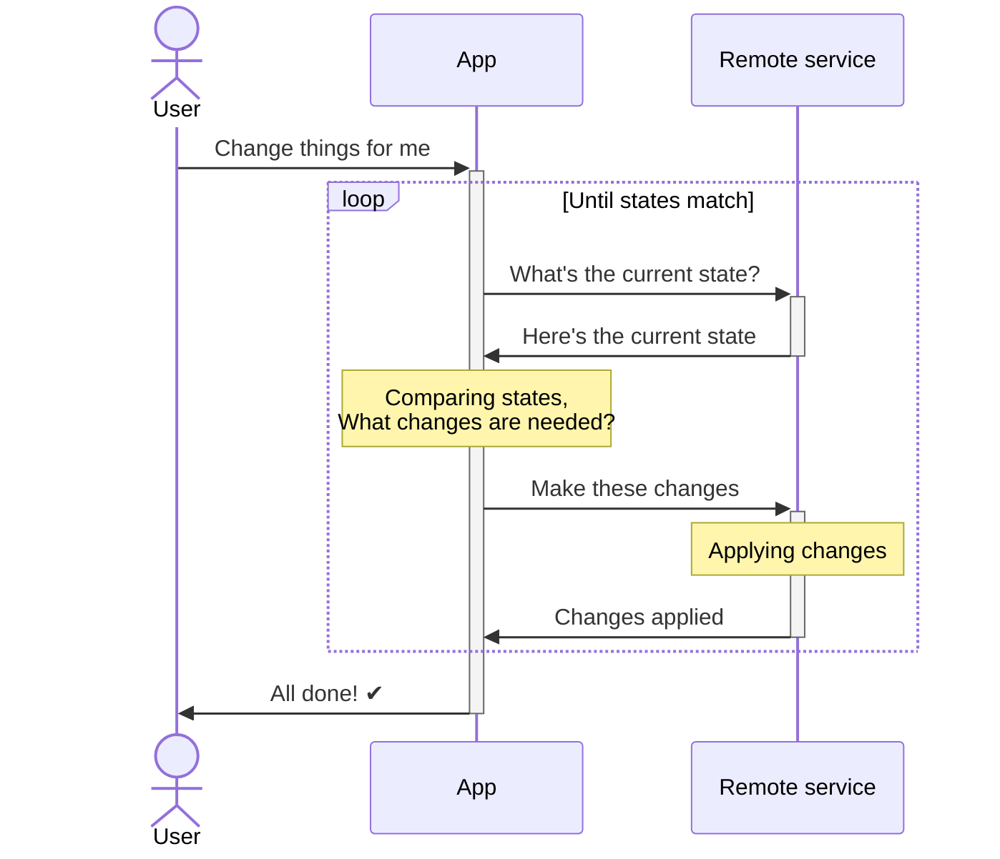
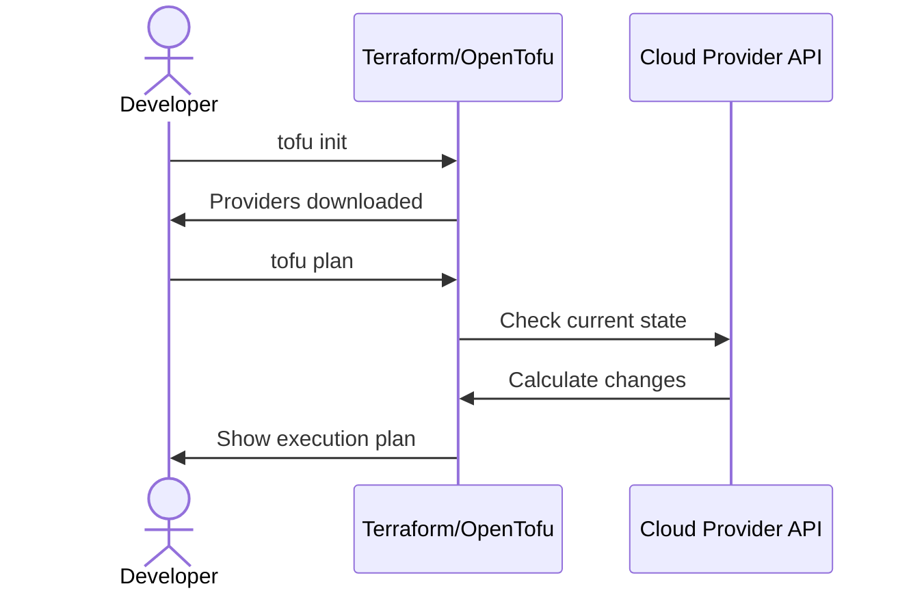
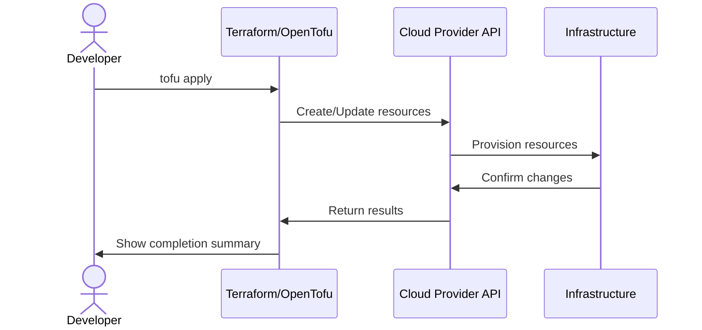
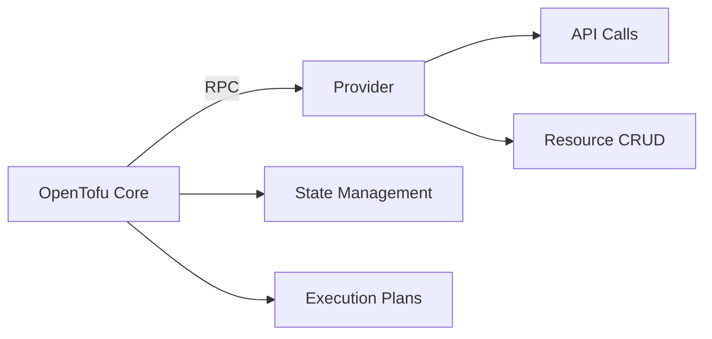
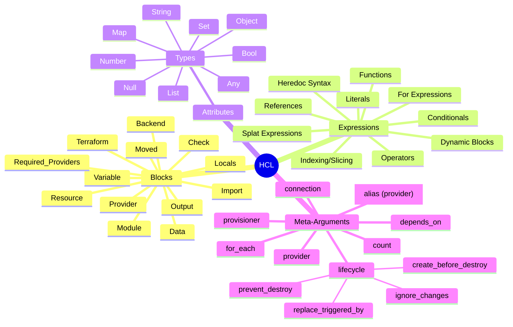

<!-- skip_slide -->

Welcome! Build Your Own OpenTofu/Terraform Provider
===

This repository contains the materials for the workshop on creating
OpenTofu (Terraform) providers.

In this workshop, I’ll guide you through the fundamentals of provider
development, culminating in building a minimalistic but functional provider
with custom logic. I’ll highlight various features of the relevant SDKs.

Each `.md` file is a presentation, and the one you’re reading now is the
introduction to the topic.

The presentations are built for
[`presenterm`](https://mfontanini.github.io/presenterm) and are meant to be run
in a modern terminal such as [`Ghostty`](https://ghostty.org/) or
[`kitty`](https://github.com/kovidgoyal/kitty).

If you’ve scanned the QR code with the repo URL, you might want to skip to
[Getting started](./00-getting-started.md#initialize-the-project).

Each exercise has a separate presentation file, and they are numbered.

If you get stuck, feel free to check out the solutions provided in the same
repo. You’ll find the folders `NN-solution`, where `NN` is the exercise number.

Good luck!

---

Challenge: Managing Complex Systems
===

* Scenario: Working on a payment system
* Multiple payment providers
* Various payment routes (through the providers)
* Different rules when to use which provider
* Rules scattered across files, DBs, and switches in external services
* Ensuring complete coverage (all currencies, card types) is complex
* Rules depend on each other: easy to create conflicts

<!-- pause -->
<!-- font_size: 3 -->

**Guess what happened with the system over time,
and how everything was working in reality?**

<!-- speaker_note: well, yeah, everything was done manually in the end -->

---

Familiar?
===



<!-- alignment: center -->
This manual loop is often slow and error-prone.

---

<!-- jump_to_middle -->

Custom Tooling Pitfalls
===

<!-- incremental_lists: false -->

* What happens when someone changes a resource outside your system? *(Drift!)*
* What happens when it fails halfway through? *(Inconsistent state!)*
* How do you handle dependencies between resources?
  *(You didn't expect you'd need **graph algorithms and topological sort**,
  didn't you?)*

---

Better: Plan First
===



<!-- alignment: center -->

No changes yet!

---

Better: Execute Changes
===

<!-- alignment: center -->
Use the plan:



<!-- font_size: 2 -->

No loops!

---

Build a Provider or a Separate Tool?
===

| **Feature** | **Build OpenTofu Provider** | **Without OpenTofu / Terraform** |
| ---: | --- | --- |
| *Go Framework* | `terraform-plugin-`{`go,sdk`} | ✅ Anything you like! |
| *Error Handling* | ⚠️ Core logic in SDK | ⚠️ Implementation effort |
| *Error Reporting*| ✅ Framework `diagnostics` | ❌ Implementation effort |
| *Object Diff* | ✅ HCL / SDK ↔ Go helpers | ❌ Implementation effort |
| *Dependencies* | ✅ Handled by OpenTofu | ❌ Implementation effort |
| *Testing Harness* | ✅ Testing utilities | ❌ Custom test harness |
| | | |
| *Timeouts* | ✅ Built-in | ❌ Implementation effort |
| *Locking (state)* | ✅ Built-in | ❓ Can be done |
| *CI/CD* | ✅ Supported | ❌ Implementation effort |
| *Visual edit / GUI* | ❌ No, only file editing | ✅ Can be done |
| *Visual diff* | ✅ Built-in | ❌ Implementation effort |
| | | |
| *Idempotency* | ✅ Built-in | ❓ Can be done |
| *Drift detection* | ✅ Built-in | ❌ Implementation effort |
| *Partial updates* | ⭕️ Supported | ❌ Manual work |
| *State history* | ✅ Pluggable | ❓ Can be done |
| *Transactions* | ❌ No, Unsupported | ❓ Can be done. Maybe |
| *Rollback* | ⚠️ No, apply previous | ❌ Implementation effort |

<!-- speaker_note: Framework—`-plugin-go` is low-level, `-sdk` is easier -->
<!-- speaker_note: Error Handling—It's about the API, so no difference -->
<!-- speaker_note: Error Reporting—SDK gives you standard way TF users expect -->

<!-- speaker_note: Comparisons—how to understand if complex object has changed -->
<!-- speaker_note: Dependencies—Does the order of applying changes matter? -->
<!-- speaker_note: Acceptance and integration testing are part of the sdk -->

<!-- speaker_note: Timeouts—wait for the lock, API timeouts, whole process -->
<!-- speaker_note: Locking—are you working with the state alone? -->
<!-- speaker_note: CI/CD—If changes are in Git, should they apply on merge? -->
<!-- speaker_note: Visual editing—If you want ClickOps, don't go OpenTofu -->
<!-- speaker_note: Visual diff—Care to review the plan before apply? -->
<!-- speaker_note: Idempotency—Is it OK to create the same resource twice? -->

<!-- speaker_note: State history—Need to inspect past changes? -->
<!-- speaker_note: Partial updates—how to apply changes to only one resource? -->
<!-- speaker_note: Transactions—All or none changes, not an OpenTofu case. -->
<!-- speaker_note: Rollback—Auto-revert on failures? Not with OpenTofu. -->

---

<!-- column_layout: [6, 7] -->

<!-- column: 0 -->

OpenTofu Provider
===

* **Complex State & Dependencies:** managing resources with intricate states
  or interdependencies. *Leverage TF Core's graph management.*
* **Collaboration:** Multiple users manage config.
  *Benefit from built-in state locking and drift detection.*
* **Standard IaC Practices:** Reuse existing Infrastructure as Code workflows,
  tooling, and CI/CD pipelines.
* **Declarative Approach:** Defining the desired *end state* is natural and
  idempotency is crucial. *The framework encourages this.*

<!-- column: 1 -->

A Custom Tool
===

* **Very Simple State Model:** Managing items with minimal dependencies or complexity.
* **Specific UI/UX Needs:** Interactions beyond config files are necessary,
  like a dedicated GUI.
* **Atomic Transactions:** Changes *must* succeed or fail as a single,
  indivisible unit. *OpenTofu doesn't offer this.*
* **Inherently Imperative Tasks:** The core logic involves sequential steps or
  procedures (e.g., complex data migrations).
* **Overriding Tech Constraints:** Must use non-Go languages/frameworks or the
  plugin architecture is unsuitable.

---

<!-- jump_to_middle -->

Focus on Your Logic, Not the Plumbing
===

---

Terraform vs OpenTofu
===

OpenTofu is a community-driven fork of Terraform.

| | OpenTofu | Terraform |
| :--- | ---: | ---: |
| Licensing | MPL 2.0 | BUSL-1.1 |
| Copyright | The OpenTofu Authors | HashiCorp, Inc. |
| Maintaining organization | Linux Foundation | HashiCorp, Inc. |
| Governance | Community-driven | Corporate-driven |

[More comparisons](https://cani.tf/)

[«Awesome» list](https://awesome-opentofu.com/)

**Provider Development Frameworks (as of now, all MPL and HashiCorp):**

| | Repo / Import |
| --- | --- |
| **High-level (modern)** | `github.com/hashicorp/terraform-plugin-framework` |
| High-level (previous) | `github.com/hashicorp/terraform-plugin-sdk` |
| Low-level (active) | `github.com/hashicorp/terraform-plugin-go` |

---

Providers
===

A **Provider** is the plugin that teaches OpenTofu how to interact with a
specific target API or platform (e.g., AWS, Kubernetes, a custom service).

**Under the hood:**

* Provider is an **executable binary**
* It's usually written in Go (e.g., using `terraform-provider-framework`).
* Distributed via OpenTofu Registry or Terraform Registry.
* OpenTofu runs it and communicates with it via gRPC.
* OpenTofu tells the provider what to create, update and delete
* THe provider calls relevant APIs.

**Key Responsibilities:**

* **Define Schema:** Resources, data sources, functions, and the attributes.
* **Authenticate:** Manages credentials for the target API.
* **Manage Resources:** Implements the Create, Read, Update, Delete logic.

---

OpenTofu Core vs Provider Responsibilities
===

| Core | Provider |
| --- | --- |
| Configuration parsing/interpolation | API client implementation |
| Dependency graph construction | Resource schema definition |
| State file management | CRUD operations |
| Plan/apply workflow execution | Authentication handling |
| Plugin RPC communication | Error translation |



---

HCL: Quick Introduction
===

<!-- column_layout: [3, 2] -->

<!-- column: 0 -->

HashCorp Configuration Language:

* Human-readable configuration language
* Declarative syntax
* Key-value pairs, blocks, lists
* Used to define infrastructure resources

<!-- column: 1 -->

HCL vs JSON (and alike):

* Comments
* Interpolation
* Functions
* Variables
* References
* Expressions

<!-- reset_layout -->

HCL **with a schema** can be mapped to JSON and back, with a couple of twists:

* A block in HCL can be either an **object** or a **list** of objects, or a
  **set** of objects.
* Schema (per provider and global — for `.tf` files themselves) is
  needed to distinguish that

[OpenTofu JSON
Configuration Syntax](https://opentofu.org/docs/language/syntax/json/)

---

HCL <-> JSON
===

<!-- column_layout: [5, 4] -->

<!-- column: 0 -->

JSON:

```json
{
  "output": {
    "bar": {
      "value": "${aws_instance.foo}"
    }
  }
}
```

<!--  column: 1 -->

Terraform:

```terraform
output "bar" {
  value = aws_instance.foo
}
```

<!-- reset_layout -->

So, it's not straightforward (e.g., note `$` sign in the JSON variant),
but it's a way to think about HCL, and you can use JSON syntax to generate
resource terraform definitions.

---

HashCorp Configuration Language
===

<!-- column_layout: [7, 3] -->
<!-- column: 0 -->



<!-- column: 1 -->

Once you have your provider developed, you can use the full power of HCL and
`Terraform`.

For provider, implement only:

* **Resource** Blocks
* **Data** Blocks
* **Provider** Block

---

What you can create
===

<!-- column_layout: [1, 1] -->
<!-- column: 0 -->

<!-- alignment: center -->
Provider

```terraform {1-8|2}

provider "foo" {
  provider_attribute = "value"
  provider_block {
    nested_attribute = 1 + 2
  }
}
```

<!-- column: 1 -->

<!-- alignment: center -->
Data Source

```terraform {1-5|2}
// "foo" is the provider name
data "foo_bar" "hello" {
  data_attribute = true
  data_source_block {
    attribute = "${expression}"
  }
}
```

<!-- reset_layout -->

<!-- column_layout: [1, 1] -->
<!-- column: 1 -->
<!-- alignment: center -->
Provider Function

```terraform
// assign to some attribute:
x = provider::foo::myfunc(1, 2)
```

<!-- column: 0 -->
<!-- alignment: center -->
Resource

```terraform {1-5|2}
resource "foo_baz" "yep" {
  ref = data.foo_bar.computed_v
  all = [0, 1, 2]
}
```

---

Provider Framework (`tfsdk`) Interfaces
===

```go
import {
	"github.com/hashicorp/terraform-plugin-framework/datasource"
	"github.com/hashicorp/terraform-plugin-framework/function"
	"github.com/hashicorp/terraform-plugin-framework/provider"
	"github.com/hashicorp/terraform-plugin-framework/resource"
}

type PlaygroundProvider struct {}
type PlaygroundDataSource struct {}
type PlaygroundResource struct {}
type PlaygroundFunction struct {}

var _ provider.Provider     = (*PlaygroundProvider)(nil)
var _ datasource.DataSource = (*PlaygroundDataSource)(nil)
var _ provider.Resource     = (*PlaygroundResource)(nil)
var _ function.Function     = (*PlaygroundFunction)(nil)
```

…and you just follow compiler errors telling you what is still missing

---

Provider Framework (`tfsdk`) Interfaces
===

| *Feature* | **Provider** | **Datasource** | **Resource** | **Function** |
| --- | --- | --- | --- | --- |
| Schema | ✅ | ✅ | ✅ | ✅ `Definition` + `Return` |
| Configure | ✅ | ✅ | ✅ | ❌ OpenTofu only, low-level |
| Read | ❌ | ✅ | ✅ | ✅ Stateless `Run()` |
| Create | ❌ | ❌ | ✅ | ❌ |
| Update | ❌ | ❌ | ✅ | ❌ |
| Delete | ❌ | ❌ | ✅ | ❌ |
| Import | ❌ | ❌ | ✅ | ❌ |

Alternatives to start learning:

* [Creating Providers](https://search.opentofu.org/docs/providers/creating)

With low-level SDK:

* [`terraform-provider-go`](https://github.com/opentofu/terraform-provider-go)
* [`terraform-provider-lua`](https://github.com/opentofu/terraform-provider-lua)

---

Ready to Start Building?
===

<!-- skip_slide -->

Now that you have an overview of OpenTofu/Terraform provider concepts,
it's time to dive into the hands-on exercises!

1. **Navigate to the First Exercise:** The workshop modules are in numbered
markdown files (`NN-*.md`). Begin with the [first one](./00-getting-started.md).
2. **Follow the Sequence:** Proceed through the exercises in numerical order
  (`01-functions.md`, `02-flags-and-attrs.md`, etc.).
3. **Check Solutions:** If you get stuck or want to compare your code,
  solutions for each exercise `NN` are available in the corresponding
  `NN-solution/` directory.

Let's get coding!

---

<!-- jump_to_middle -->

Workshop
===

---

<!-- jump_to_middle -->

Thank you
===

---
```ansi
█ ▄▄▄▄▄ ██▀▄██▀▄██▄  █▄▄ ▀█ ▄▄▄▄▄ █
█ █   █ █▄▀█▄▀▀█▄██▀  █▀███ █   █ █
█ █▄▄▄█ ██▄▀▀ ▄▀▀▄█▀ █▀█ ▄█ █▄▄▄█ █
█▄▄▄▄▄▄▄█ █▄▀▄█▄▀▄▀▄▀▄▀▄█ █▄▄▄▄▄▄▄█
█▄▄▄▀▄ ▄▄ ▀█▀ ▀██▀▄██▀ ▀█   ██▀▄█▀█
█ ▄ ██ ▄▀▀▀ ▄ ▀ █▀▀ ▀▀▀▄█▀█ █▀ █ ▄█
█▄▄   ▀▄▀ █  ██ ▄  █▄▄▄▄▄   ▀█ ▀█ █
█▄▀█▄ █▄██  ▀█▄█▀▄▀█▀▀ ▀▀▀▄▀▀█▀█ ▄█
██▀▄█▄ ▄█ █▄▀ ▀█▄  █▄  ▀▄▄  ███▀▄ █
█   █▀ ▄█▀▀█▄ ▀ ██▀▀█▄▀█▀▀▄█▄▄ █ ▄█
██▄▀▄█ ▄ ▀█  ██ █▀ ▀█▀ ██ ▀ ▄██▀▄ █
█▄▀▀█ ▄▄ ▀█▀▀█▄███ ▄█▀▀▀▀ ▄▀▀ ▄█ ▄█
█▄█▄█▄▄▄▄▀▀▄▀ ▀█▄ ▄▄▄  ▀▀ ▄▄▄ ██▀▀█
█ ▄▄▄▄▄ █ █ ▄ ▀ █▄▀▀█  ▄▄ █▄█ ▄█  █
█ █   █ █▄▀█ ██ █▀ ▀█  ▀█ ▄▄  ▀▀█▀█
█ █▄▄▄█ █ ▀ ▀█▄██▀ ▀▀█ ▄ ▀▀█ ▄▄▄▀▄█
█▄▄▄▄▄▄▄█▄█▄█▄██▄▄▄██▄▄█▄▄▄█▄▄▄█▄▄█
```
